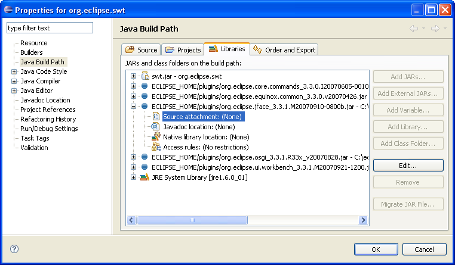

JFace
=====

JFace is a UI toolkit with classes for handling many common UI programming tasks. 
JFace is window-system-independent in both its API and implementation, and is designed to work with SWT without hiding it. 
JFace includes the usual UI toolkit components of image and font registries, text, dialog, preference and wizard frameworks, and progress reporting for long running operations. 
Two of its more interesting features are actions and viewers. 
The action mechanism allows user commands to be defined independently from their exact whereabouts in the UI. 
Viewers are model based adapters for certain SWT widgets, simplifying the presentation of application data structured as lists, tables or trees.

More information on JFace is available in the [JFace section](https://wiki.eclipse.org/The_Official_Eclipse_FAQs#JFace) of [The Official Eclipse FAQs](https://wiki.eclipse.org/The_Official_Eclipse_FAQs).

The [JFace data binding framework](JFaceDataBinding.md) was introduced in Eclipse 3.2. 
Data binding allows linking UI elements and models so that users can edit or view the data in the model. 
The framework makes it easy to connect data sources to widgets such as text fields, combos, tables and trees, for viewing and editing. 
Using it relieves developers from writing and registering listeners with widgets and model objects.

More information
----------------

*   [The JFace UI framework](http://help.eclipse.org/helios/topic/org.eclipse.platform.doc.isv/guide/jface.htm) section, within the [Eclipse Platform Plug-In Developer's Guide](http://help.eclipse.org/helios/nav/2) \- also available from Eclipse online help, in Eclipse platforms with the plug-in development documentation installed
*   [JFace section](https://wiki.eclipse.org/The_Official_Eclipse_FAQs#JFace) of [The Official Eclipse FAQs](https://wiki.eclipse.org/The_Official_Eclipse_FAQs)
*   Plug-in Developer's Guide: [JFace](http://help.eclipse.org/galileo/topic/org.eclipse.platform.doc.isv/guide/jface.htm)
*   [Workbench and JFace Articles](Eclipse_Corner.md)
*   [JFace code snippets](JFaceSnippets.md)

Using JFace outside the Eclipse platform
----------------------------------------

JFace can be used in standalone SWT + JFace apps, without requiring the Eclipse Runtime or other parts of the Eclipse Platform. 
This was made easier to do in 3.2, with the only prerequisites for JFace being reduced to SWT, the new **org.eclipse.equinox.common** plug-in, and **org.eclipse.core.commands** plug-in.

For more details, see [Bug 49497](https://bugs.eclipse.org/bugs/show_bug.cgi?id=49497#c55).

In 3.3 an optional dependency on the **org.osgi.framework** package was added which is defined in the **org.eclipse.osgi**. 
If this plug-in is absent JFace will continue to function but without the benefit of internationalization support for its images.

### Setting Up an Eclipse Project to use SWT and JFace

This section contains detailed instructions for creating an Eclipse project for developing a stand-alone Java program that uses SWT and JFace. 
This will be broken down into three steps, as follows:

1.  Identify the required external JAR files for JFace.
2.  Create an Eclipse project (called org.eclipse.swt) that will have all of the required SWT and JFace JAR files on its build path and configure the Order and Export tab of the Build Path to export these files. This project will supply the required JAR files to any other Eclipse project that needs them.
3.  On any new Java projects that need to use SWT or JFace, simply add the org.eclipse.swt project as a required project on the Projects tab of the Build Path.

Detailed instructions for each of these steps are outlined below.

### Identify the Required External JAR Files for SWT and JFace

A JFace project requires the SWT classes, JFace classes, and other Eclipse classes that JFace is dependent on. 
The SWT classes will be provided in the file we download from the SWT Project Website. 
The JFace file, and the files the JFace is dependent upon, need to be added to the project manually.

The first step is to identify the required JAR files for JFace. 
The primary file is called org.eclipse.jface, followed by specific version information. 
In addition, this file requires classes from other Eclipse JAR files. 
For Eclipse version 3.3.1.1, the required JAR files for JFace are as follows (where <version info> is the specific version information):

*   org.eclipse.core.commands_<version info>.jar
*   org.eclipse.equinox.common_<version info>.jar
*   org.eclipse.jface_<version info>.jar
*   org.eclipse.osgi_<version info>.jar
*   org.eclipse.ui.workbench_<version info>.jar

The file org.eclipse.ui.workbench_<version info>.jar is not required to run the standard JFace classes. 
However, since it adds a number of very useful Dialogs (such as ListDialog, ListSelectionDialog, and others), it is included here as well.

You can find the JFace dependencies for any Eclipse version if you have the Plug-in Development Environment, which includes the Plug-ins and Plug-in Dependencies views. 
To do this:

1.  Select Window/Show View/PDE/Plug-ins. (Note, if you don't have a PDE view folder, it means you don't have the Plug-in Developer Environment plug-in in your Eclipse installation.)
2.  Select the org.eclipse.jface plug-in from the list.
3.  Right-click and select Open Dependencies. This will open the Plug-in Dependencies view. An example of this view for Eclipse version 3.3.1.1 is shown below.
    
    
    
4.  Press the Set Flat Layout button to see a simple flat list of the required plug-ins, as shown below.
    
    
    
5.  Each plug-in on the list corresponds to a JAR file in the plugins directory for your Eclipse installation. If the list for your Eclipse version is different than the list above, make a note of it and modify the remaining instructions accordingly. At this point, we have the list of JAR files that we need.

### Create the Eclipse SWT/JFace Project

In this step, we will create one project that will point to all of the JAR files needed for SWT and JFace development. 
Here are the steps:

1.  Download the SWT stable release for your Eclipse version and your operating system from [Eclipse SWT Project Page](http://www.eclipse.org/swt/). For example, for Eclipse version 3.3 and Windows, select the Windows link under Releases / Stable, as shown in the screenshot below.
    
    
    
2.  This will download a zip file that contains our org.eclipes.swt project. (For example, for Eclipse 3.3 and Windows, the file is called swt-3.3.1.1-win32-win32-x86.zip.) Do not unzip this file. Just download it and note the directory where you saved it.
3.  Inside Eclipse, select Import / Existing Projects into Workspace, as shown below.
    
    
    
4.  Press Next and select the option Select archive file. Browse to the zip file you just downloaded. A project called org.eclipse.swt will display in the Projects list. Make sure it is checked, as shown below, and press Finish.
    
    
    
5.  Eclipse will create the project org.eclipse.swt in your workspace. This project already has the required SWT JAR file, including source code for the SWT classes. This is all you need to develop SWT applications. But for JFace applications, you need to continue with the remaining steps.
6.  Make sure the org.eclipse.swt project is highlighted and select Project / Properties / Java Build Path and select the Libraries tab.
    
    
    
7.  Next, we'll create a new Variable called ECLIPSE_HOME that points to the directory where Eclipse is installed. This will make it easier to keep this project updated as new Eclipse versions are installed.
8.  Press the Add Variable... button to display the New Variable Classpath Entry dialog.
    
    
    
9.  Press the Configure Variables button to display the Classpath Variables dialog.
    
    
    
10.  Press New to display the New Variable Entry dialog. Enter ECLIPSE_HOME in the Name field. For the Path field, press Folder and browse to the top-level directory where Eclipse is installed. This is the directory that contains the Eclipse executable file (e.g., "eclipse.exe" on Windows) and has subdirectories including "configuration", "features", and "plugins". In the example below, Eclipse is installed in “c:\\eclipse”.

1.  Press OK. Now the ECLIPSE_HOME variable will display in the Classpath Variables list. Press OK again to return to the New Variable Classpath Entry. Press Cancel to return to the Libraries tab of the Java Build Path dialog.
2.  Now, we're ready to add our JFace JAR files. We'll use the ECLIPSE\_HOME classpath variable we just created. That way, if the location of our Eclipse installation changes, we can just change the ECLIPSE\_HOME variable to point to the new location.
3.  Press the Add Variable button to again display the New Variable Classpath Entry dialog. Make sure ECLIPSE_HOME is selected and press the Extend... button to display the Variable Extension dialog, shown below.
    
    
    
4.  This will display the subdirectories of the ECLIPSE_HOME directory. The JAR files we need are in the plugins directory.
5.  Expand the plugins directory and browse down to the org.eclipse.core.commands and select it as shown below. (Note that the JAR file version numbers may be different.)

1.  You can select multiple JAR files from this list by holding down the Ctrl key while clicking. Scroll down the list and select the remaining JAR files. The complete list for Eclipse 3.3 is shown below.
    1.  org.eclipse.core.commands_<version info>.jar
    2.  org.eclipse.equinox.common_<version info>.jar
    3.  org.eclipse.jface_<version info>.jar
    4.  org.eclipse.osgi_<version info>.jar
    5.  org.eclipse.ui.workbench_<version info>.jar
2.  If there are any other JAR files that displayed for your Eclipse version when you looked at the JFace dependencies above, select them here as well. As mentioned earlier, org.eclipse.ui.workbench is not actually part of JFace but is included here because it supplies some useful dialog classes. When you have selected all of the required files, press OK. The Libraries tab should now show all of the JAR files, similar to the screenshot below.

1.  The source code for the SWT classes was added automatically when the org.eclipse.swt project was imported. If you like, you can add the source code to the JFace JAR file. Note that the JFace source code comes as part of the Eclipse Platform Plug-in Developer Resources feature, which is included in the Eclipse for RCP/Plug-in Developers download. If you don't have this Eclipse package, you can download the Eclipse Platform Plug-in Developer Resources feature from the Eclipse Project Updates update site, as shown below.

1.  To attach the JFace source code, expand the JFace JAR file and select the Source Attachment, as shown below.

1.  Press Edit to display the Source Attachment Configuration dialog. Press the Variable button, select the ECLIPSE_HOME variable, and press OK to display the screen below.

1.  Now press the Extension... button. This will open the Variable Extension Selection dialog. Again, expand the plugins directory. Find the directory called org.eclipse.rcp.source_<version infomation>. Note that this is a directory, not a JAR file.
2.  Expand this directory, expand the src subdirectory, scroll down to the directory called org.eclipse.jface_<version information>. Expand this, and select the file called src.zip, as shown below.

1.  Press OK twice to return to the Libraries tab. At this point, you have attached the JFace source code and the screen should look like the one below.

1.  Finally, select the Order and Export tab and check the check boxes next to each of the ECLIPSE_HOME JAR files so that the screen appears as shown below.

1.  Press OK. At this point, the org.eclipse.swt project is set up and will supply all of the required libraries for a SWT and JFace project.

### Add the org.eclipse.swt Project to Your Java Project

Once the steps above are complete, it is very easy to add the SWT and JFace libraries to any Java project.

1.  Select the project that will be used to develop SWT and JFace programs (for example, "MyProject) and select Project / Properties / Java Build Path.
2.  Select the Projects tab. Press Add. The org.eclipse.swt project will display in the Select projects to add: list. Select this project by checking the box. The screen should display as shown below.
    
    
    
3.  Press OK to return to the Projects tab of the Java Build Path dialog. The screen should show the org.eclipse.swt project as shown below.

### Test Your org.eclipse.swt Project

At this point, your Java project should have everything needed to create a stand-alone SWT or JFace application. You can test this with the following steps.

1.  In your Java project, create a new package called jface.test.
2.  Create a new class called JFaceTest, as shown below.

1.  In the New Java Class dialog, for the Superclass press Browse and enter ApplicationWindow. The class ApplicationWindow, in the org.eclipse.jface.window package, should display as an option, as shown below.
    
    
    
2.  Select ApplicationWindow and press Finish to create the class.
3.  In the Java editor, click on the word ApplicationWindow and press F3. This should open the Java source code for the ApplicationWindow.class.

At this point you are ready to start developing stand-alone SWT and JFace applications.

### Deploying a Java Program That Uses SWT and JFace

Once you have developed a stand-alone Java program that uses SWT and JFace, you will want to be able to deploy it to other computers. This section includes detailed instructions for doing this.

Deploying a SWT / JFace application is similar to deploying any Java application that uses external JAR libraries, with one important difference. Starting with Eclipse version 3.3, the SWT JAR file (e.g., swt.jar in the org.eclipse.swt project referenced above), contains platform-specific executable files (e.g., *.DLL files for Windows, *.so files for Linux) as well as Java classes. For this reason, the SWT JAR file must be matched to the target runtime platform. If you want to target more than one platform (e.g., Windows and Linux), you will need a separate SWT JAR file for each target platform.

#### Step by Step Instructions

1.  Create a runtime folder for the desired runtime target on your system (e.g., c:\\jface\\runtime-linux). Note that the target platform does not need to be the same as your development platform.
2.  Find the correct SWT JAR file for the desired target platform. You can download the desired ZIP file from [the SWT Project Page](http://www.eclipse.org/swt). For example, for Eclipse 3.3 and a target platform of Linux, download the file swt-3.3.1.1-gtk-linux-x86.zip. Expand this ZIP file and copy the swt.jar file to the runtime folder.
3.  Copy the JAR files that JFace needs to the runtime folder. They are found in the Eclipse plugins subfolder under your Eclipse installation. For Eclipse version 3.3, these files are as follows:
    *   org.eclipse.core.commands_<version info>.jar
    *   org.eclipse.equinox.common_<version info>.jar
    *   org.eclipse.jface_<version info>.jar
    *   org.eclipse.osgi_<version info>.jar
    *   org.eclipse.ui.workbench_<version info>.jar
4.  If desired, and to save some typing, rename the JAR files to remove the detailed version information. For example, rename the org.eclipse.jface JAR file to "org.eclipse.jface.jar" or "org.eclipse.jface_3.3.jar".
5.  Create a manifest file for your application using the Eclipse text editor (e.g., myapplication-manifest.txt). The text of the manifest should be as follows:
    
    > Manifest-Version: 1.0
    > Class-Path: swt.jar 
    >   org.eclipse.core.commands.jar 
    >   org.eclipse.equinox.common.jar 
    >   org.eclipse.jface.jar 
    >   org.eclipse.osgi.jar 
    >   org.eclipse.ui.workbench.jar
    > Main-Class: mypackage.MyClassWithMainMethod
    > (blank line at end of file)
    > 
    >     Manifest-Version: 1.0
    >     Class-Path: swt.jar 
    >       org.eclipse.core.commands.jar 
    >       org.eclipse.equinox.common.jar 
    >       org.eclipse.jface.jar 
    >       org.eclipse.osgi.jar 
    >       org.eclipse.ui.workbench.jar
    >     Main-Class: mypackage.MyClassWithMainMethod
    >     (blank line at end of file)
    >     
    > 
    >  
    
6.  Make sure the JAR file names in the manifest file exactly match the names in your runtime folder. Also, make sure the manifest file ends with a blank line and that there are at least one space before the continuation lines for Class-Path:. Finally, put the name of your package and class that contains the main() method for the Main-Class.
7.  In Eclipse, select File/Export/Java/Jar file and press Next.
8.  On the JAR File Specification dialog, select the source files for the classes you want in the application. In the export destination, browse to the runtime folder and enter in the desired name of the JAR file (e.g., myapplication.jar or myapplication_linux.jar). Press Next.
9.  On the JAR Packaging Options dialog, make sure the "Export class files with compile warnings" box is checked. Otherwise, if your source files have any compile warnings, they will not be included in the JAR file. Press Next.
10.  In the JAR Export dialog, select the option "Use existing manifest from workspace". Browse to the manifest file you created above. Press Finish.
11.  If the JAR file already exists, you will be asked to overwrite it. Select Yes. If your project had any compile warnings, a message will display. If so, press OK.
12.  At this point, the JAR file for your application has been created in the runtime directory. In your operating system's file explorer, browse to the runtime directory and run your JAR file. For example, in Windows, you can just double-click on it in the Windows File Explorer or, from the "cmd" prompt, you can enter the command: java -jar myapplication.jar. The application should run and the main application window should display.

#### Troubleshooting Errors

A common error message when trying to run a stand-alone application is: "Could not find the main class. Program will exit.", This error can be caused by any of the following problems:

1.  One or more of the required JFace JAR file names is missing or misspelled in the manifest file.
2.  One or more of the of the required JFace JAR files is missing in the runtime folder.
3.  The Main-Class: is incorrect in the manifest file.

