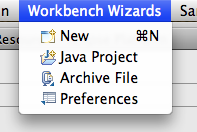

Menu Contributions/Workbench wizard contribution
================================================

< [Menu Contributions](/Menu_Contributions "Menu Contributions")

Workbench Wizard Contribution
-----------------------------

You can add your new/import/export wizards to a menu/toolbar via Command contributions. You need to use the standard command ids (org.eclipse.ui.newWizard, org.eclipse.ui.file.import and org.eclipse.ui.file.export) with the wizard id as the parameter. Eg:

         <extension
      point="org.eclipse.ui.menus">
            <menuContribution
      allPopups="false"
      locationURI="menu:org.eclipse.ui.main.menu?after=additions">
               <menu
      label="Workbench Wizards">
                  <command
      commandId="org.eclipse.ui.newWizard"
      style="push">
                  </command>
                  <command
      commandId="org.eclipse.ui.newWizard"
      style="push">
                     <parameter
      name="newWizardId"
      value="org.eclipse.jdt.ui.wizards.JavaProjectWizard">
                     </parameter>
                  </command>
                  <command
      commandId="org.eclipse.ui.file.import"
      style="push">
                     <parameter
      name="importWizardId"
      value="org.eclipse.ui.wizards.import.ZipFile">
                     </parameter>
                  </command>
                  <command
      commandId="org.eclipse.ui.file.export"
      style="push">
                     <parameter
      name="exportWizardId"
      value="org.eclipse.ui.wizards.export.Preferences">
                     </parameter>
                  </command>
                  <command
      commandId="org.eclipse.ui.window.preferences"
      style="push">
                  </command>
               </menu>
            </menuContribution>

Would result in:

