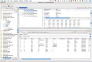
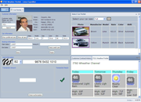
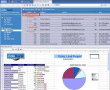
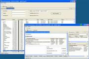
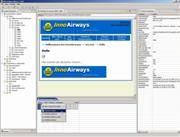
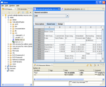
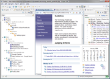

# Commercial Rich client platform (RCP) applications

*This content was archived from https://www.eclipse.org/community/rcpcp.php (last captured February 12, 2024)*

This page contains links to applications built on the Eclipse Rich Client Platform (RCP). The listings here are intended to get you started in finding out more about products and projects that use the Eclipse RCP. You can also view a pdf presentation of RCP based applications.

We have also prepared some case studies of organizations that are using Eclipse RCP. Hopefully it will provide you a better understanding of the benefits from using Eclipse RCP for your application platform.

We'd like these pages to be useful to you - so please email us your pointers and comments!

## Commercial RCP Applications

### AB ZealCore System Debugger

**Website:** [http://www.zealcore.com/products.html](http://www.zealcore.com/products.html)

The ZealCore System Debugger collects and refines information contained in logs. This is achieved by advanced post processing of log information, by fusion of different logs, by mapping recorded information to high level models, and, not the least, by bringing order to the log exploration and debugging process. The System Debugger can be used during development, integration, test, deployment, and operation depending on when the logs have been gathered. The ZealCore System Debugger lets you create projects and logsets for tracking down bugs in software. A logset can cover information from several logs, and a project can manage several logsets, either from one and the same system collected at different occasions, from different software versions or e.g., from different nodes in a distributed system. Moreover, the ZealCore System Debugger allows you to make advanced post processing of data including filtering and advanced searches that can pinpoint a specific behavior. The search results are synchronized with other views and exploring the results is just a click away. Assertions allow for automatic fault identification, risks and negative trends. The latter is especially powerful when the post processing is performed on e.g., logs from different versions of software for a system � making it possible to detect subtle behavioral differences between the software versions which later could lead to system failures or poor performance.

### Actuate BIRT Report Designer

**Website:** [http://www.actuate.com/birt](http://www.actuate.com/birt)

The Actuate BIRT Report Designer is a powerful tool for designing and deploying reports against data sources ranging from typical business SQL databases, to XML data sources, to in-memory Java objects. The Actuate BIRT Report Designer provides a complete visual report design environment and is based on the Eclipse Open Source BIRT and RCP projects. Utilizing the benefits of RCP, this tool focuses on the needs of the typical report developer who wants an easy to use tool for creating reports. The Actuate BIRT Report Designer is part of an integrated family of reporting tools that range from the Actuate BusinessReport Studio, a web based report design tool for business users, to the Actuate BIRT Report Designer Pro, aimed at professional developers. Actuate products also include a variety of deployment choices for reports, from an embedded Java engine, to the enterprise class iServer, with report scheduling, distribution and a full high-availability, clustered server.

### AlterPoint DeviceAuthority

**Website:** [http://www.alterpoint.com/](http://www.alterpoint.com/)

AlterPoint helps you optimize your network investment The world's most respected enterprises use AlterPoint's Advanced Network Management Solutions to maintain existing infrastructure, ensure continuous compliance, and roll out new technology. Because network configurations are at the root of the performance, security and complexity challenges that next generation networks create, AlterPoint built DeviceAuthority, the world's first multi-platform, network change and configuration software solution designed to optimize network investment. DeviceAuthority normalizes configurations across different types of devices from multiple manufacturers, making it much simpler to enforce policies, perform upgrades, make changes, manage security, etc. By absorbing the underlying details of devices, DeviceAuthority provides a unified management interface to reduce the number of tools needed to manage the network. DeviceAuthority can manage thousands of changes per hour and accommodate the largest, most diverse, and sophisticated networks. After normalizing the configuration data, DeviceAuthority collects and organizes this data in the Network CMDB. This unique unified data model approach enables policies and knowledge to be mapped across vendor types to single-vendor manageability, with multi-vendor flexibility�that can also be leveraged by other tools. AlterPoint�s Integrated Network Environment (INE) is based on the Eclipse platform with over 100,000 developers worldwide. The INE combines powerful network engineering tools with the flexibility to create a single customized �workbench� that can easily accommodate and integrate all other tools.

### arlanis Universal Data Converter

**Website:** [http://www.arlanis.com/](http://www.arlanis.com/)

The arlanis Universal Data Converter is an all-purpose data conversion tool to convert almost any data file - whatever its format may be - into another one. It is suitable in virtually any IT project and can easily be integrated in foreign architectures - due to its universal and unique design. With the arlanis Universal Data Converter you can convert data from one system into another, you can manage B2B data exchange and you can create import- or export-interfaces for your own applications. Data conversions can be done on a regular basis or as one-time data migrations.

### Applied Biosystems - Sequence Scanner Software

**Website:** [http://www.appliedbiosystems.com/sequencescanner](http://www.appliedbiosystems.com/sequencescanner)

Sequence Scanner Software is a freely available program for viewing, editing, printing, reporting, and exporting the DNA sequence data generated by Applied Biosystems's DNA sequencing instruments. The application is a Eclipse v3.1 RCP application which leverages many features of Eclipse including the preferences API, the forms API, drag-and-drop with the OS, and the underlying workbench framework. Prominent features include the ability to review multiple electropherogram traces in a thumbnail format, simultaneous viewing of raw and analyzed trace data, seven different reports for reviewing data quality, high-quality printing with print preview, and the ability to export trace data in several graphical formats, including jpg and pdf. Follow the link for a slide show of screen shots.

### Atante eye.CRM

**Website:** [http://www.atante.pl/](http://www.atante.pl/)

eye.CRM is a CRM (Customer Relation Management) application software, which enables the users to manage their relationships with customers, including finding, winning and activating new customers, as well as subsequent actions connected with the trade procedure. By using a central data source, the software provides an effective exchange of information between employees dealing with a particular customer and enables a quick response to all the events regarding this customer. Shared documents' system give all the entitled the access to the current customer documentary. Advanced privileges system gives administrators total control over users' access to modules of the application, as well as to the particular data. The software was prepared to handle any size of groups of users and to enable managers to monitor the subordinates� work. An inappreciable support for supervisors is a reporting system BIRT, which was made the most of. The extended calendar views (created in GEF), which are used by the software, help the users in their everyday work and provide the control over their scheduled events. MySQL database management system, applied in the software, has been fully used, with its advanced facilities, such as: a database transactions, table partitioning, and many others, which gives the program invaluable stability. The application software was designed to maximize the benefits coming from RCP, such as the possibility to split the functionalities between a number of plug-ins. Thanks to such a software architecture, changes done in the final product are neither time- nor source-consuming.

### Bay Breeze Software - SQL Edge

**Website:** [http://www.baybreezesoft.com/](http://www.baybreezesoft.com/)

SQL Edge allows users to execute SQL queries, browse schema information and visualize data relationships. With SQL Edge, users can use only one query to retrieve data in a master table, and then browse data in all related detail tables. Users can also edit table data in the data grids.

### BaZaa

**Website:** [http://bazaanetworks.com/](http://bazaanetworks.com/)

BaZaa is a real-time peer-to-peer search, listing and notification system that automatically pushes relevant matches to your desktop based on your personal preferences. With BaZaa you list or search items quickly and buy and sell with no commissions and assured privacy No wasted time Assured privacy No Commissions No irrelevant information No more endless searching of multiple websites Information pushed to your desktop in real-time based on your preferences

### BigBlogZoo

**Website:** [http://www.bigblogzoo.com/](http://www.bigblogzoo.com/)

The BigBlogZoo is a Semantic Web Browser. Nearly 80,000 newsfeeds and blogs have been categorized and integrated into a collaborative framework we call the Zoo. We present to the user the channel concept, much like a television, except for a browser. Users can submit, browse, spider and reaggregate these channels. Future enhancements for collaboration will include the ability to reorganize and rate channels.

### BSI CRM on Eclipse

**Website:** [http://www.bsiag.com/](http://www.bsiag.com/)

BSI CRM with ORS - Your CRM Solution on Eclipse. This customer relationship management (CRM) solution is a fully configured RCP application to support the whole customer contact process from first contact to the successful project implementation and also retention management. This RCP solution is currently in daily use at PostFinance, one of the major financial solution provider of Switzerland. Consultants manage their contacts, tasks, projects, marketing campaigns with ORS. BSI Business Systems Integration AG (www.bsiag.com) has integrated the standard ORS into the Eclipse framework thus providing all benefits of RCP.

### CCTVnet

**Website:** [http://www.cctvnet.biz/](http://www.cctvnet.biz/)

CCTVnet is a comprehensive video monitoring/recording software for network-based CCTV plants with emphasis on observation and intervention. The well-known similar video and audio crossbars are replaced by modern network technology by a virtual matrix. It is now possible to make all safety-relevant information accessible everywhere independently of their geographical origin, in order to be able to seize the appropriate measures fast and reliably. CCTVnet is suitable for any size of CCTV system, from a single site/building to a geographically distributed system. Certain optional features like work-delegation, VoIP, redundancy, and scalability make it a good choice even for large systems with many different sites. As opposed to our competitors, CCTVnet supports different hardware manufacturers which helps you to protect your hardware investments and keeps you open for future inventions. Due to this independence, it is also possible to migrate existing analogue systems without replacing the hardware.

### CoreFiling SpiderMonkey

**Website:** [http://www.corefiling.com/products/spidermonkey.html](http://www.corefiling.com/products/spidermonkey.html)

SpiderMonkey is a powerful multi-user XBRL taxonomy editor built on the Eclipse platform. XBRL, the eXtensible Business Reporting Language, offers an open system standard for the reporting of financial and statistical information. SpiderMonkey is a flexible modelling tool that allows business users to create, refine and extend XBRL taxonomies, the �dictionaries� which specify the precise definitions of terms used in financial documents. The XBRL standard is considered by many as a successful market-based implementation of semantic web concepts. XBRL taxonomies can be easily understood as ontologies by those working in that sphere. As an RCP application, SpiderMonkey can provide an effective cross-platform user experience and customers can readily take advantage of plug-ins to extend the application. There is a fully functional, free version of the tool available for download. A supported single user version, as well as a full multi-user edition, is also available.

### Crypto Intelligence - CodeSigner

**Website:** [http://www.cryptointel.com/codesigner.html](http://www.cryptointel.com/codesigner.html)

CodeSigner is a unique and unmatched approach to automating the software signing process to scale on an enterprise level, offering software integrity preservation and software authorization policies to exist. Software signing protects companies and their clients from fraudulent code that could introduce computer viruses, worms, and other malicious code designed to disrupt and steal from organizations and clients alike. Code signing works by validating the software�s content and it�s author.

### DeltaLearn Advanced Editor - DeltaLearn

**Website:** [http://www.deltalearn.com/](http://www.deltalearn.com/)

DeltaLearn Advanced Editor is an e-learning content generation tool based on the SCORM standard. Deltalearn SCORM editor is a comprehensive integrated SCORM manifest editing environment with a powerful graphical editor for generating SCORM metadata that improves productivity and dramatically decreases authoring time by replacing the traditional error-prone, time-consuming, manual XML manifest editing. DeltaLearn Advanced Editor comes out of the box with a comprehensive set of features and capabilities; a fast, powerful, standards-based, user-friendly SCORM manifest editor that enables you to easily create complex SCORM content that can operate with any compliant LMS.

### DeltaWalker

**Website:** [http://www.deltopia.com/](http://www.deltopia.com/)

DeltaWaker is a file and folder comparison application by Deltopia Inc. DeltaWalker lets you compare, edit, and merge files and synchronize folders. It runs on Windows, Mac OS X and Linux. DeltaWalker is a compelling choice for software, web, and legal professionals, as well as scientists, engineers and anyone who works with text, documents, and folders that change over time. Highlights: Finely tuned and optimized file and folder comparison engine Unicode support with character encoding auto-detection, when character encoding information is available Structure comparison and visualization of XML files Ergonomic file and folder comparison integration Extensive in-place text editing capabilities, where changes are instantly processed by the differencing engine. Two and three-way file and folder comparison, incl. vertical, horizontal, and ancestor on top layouts Manual and automatic (three-way comparison only) merging of differences Unlimited, intelligent undo/redo Color highlighted differences and changes (QuickDiffs) Birds-eye difference view and navigation Print/print-preview Patch creation capabilities Command-line interface Notification mechanism for local disk changes of files and folders loaded in DW Automatic software updates

### eClarus - Business Process Modeler for Business Analysts

**Website:** [http://www.eclarus.com/products_business.html](http://www.eclarus.com/products_business.html)

eClarus Business Process Modeler for Business Analysts is a business process diagramming, modeling, and IT collaboration tool. It enables business analysts at all technical levels to communicate and collaborate more effectively with IT, help cut application change backlogs, and improve control of business rules by business stake-holders.

### Eiswind Book Publishing Software

**Website:** [http://www.book-publishing-software.com/](http://www.book-publishing-software.com/)

Eiswind Book Publishing Software is an easy to learn and use solution, that's highly adaptable to your individual needs. Our Solution is a multi-user system. Data and documents are stored on a central server, that may be installed at your site or hosted by Eiswind. We communicate through a secure SSL layer, so that you can access your data from wherever you are on the internet without any hassle. It's based on a modular system, with an open interface concept. Eiswind Publishing Software grows with your needs. Eiswind Book Publishing Software is available in Mac OS/X and Windows versions.

### Embarcadero Change Manager - CM/Data, CM/Config

**Website:** [http://www.embarcadero.com/products/changemanager/index.html](http://www.embarcadero.com/products/changemanager/index.html)

Embarcadero Change Manager 4.0 is a professional-grade database change management tool for both application and database developers. Change Manager CM/Data is a high-speed database tool that compares, validates, and synchronizes data between tables that are within the same database, in two different databases, and even across different DBMSs (e.g. SQL Server to SQL Server, SQL Server to Oracle, etc.) CM/Data speeds up large, distributed data comparison jobs to accelerate development and data migrations. By replicating complete production data in development and test databases, CM/Data lets developers troubleshoot and resolve issues faster and more accurately. CM/Data helps developers manage data differences, migrate data from test to production, verify data replication, and ensure reference data is accurate across multiple applications. Change Manager CM/Config is a configuration management tool that compares, monitors, and archives database configuration attributes across hundreds of database instances in the enterprise.

### Embarcadero Technologies EA/Studio Community Edition

Embarcadero Technologies EA/Studio Community Edition Embarcadero Technologies EA/Studio Community Edition is a free business process modeling (BPM) tool built on the Eclipse framework. Business process modelers and database architects can use it to engage in more productive and efficient enterprise architecture modeling, including documenting business processes for regulatory compliance purposes. EA/Studio Community Edition supports XML and the business process modeling notation (BPMN), includes standard process modeling elements, and offers the ability to easily import Visio diagrams. When additional functionality is required, users can upgrade to the commercial version of EA/Studio , which includes conceptual modeling, impact analysis and usage reporting. Users of both EA/Studio Community Edition and the commercial version of EA/Studio can seamlessly collaborate and share files between the two versions. EA/Studio Community Edition is available free of charge and can be accessed by visiting www.embarcadero.com/products/eastudio/communityedition .

### Ember - Insight Desktop

Ember - Insight Desktop Ember's InSight Desktop is the most integrated ZigBee application debugging tool available. By providing developers with a complete view of their network in a graphical manner, InSight Desktop greatly reduces debugging effort and time to market. From within InSight Desktop, developers can automatically discover and connect to their target devices over a TCP/IP network using InSight Adpaters and Ember�s unrivaled Ethernet backchannel technology.

### ezMgt

**Website:** [http://www.ezmgt.com/](http://www.ezmgt.com/)

EzMgt provides a set of tools developed to help you monitor your network. Our free MIB Browser includes a MIB Editor (content assistant, SMIv2 compiler, syntax highlighting, code folding, hyperlink navigation), SNMP Query View to query and manage SNMP agents, SNMP Tracer View, and tools like ping, traceroute and whois.

### Future Management - Logic MindGuide

**Website:** [http://www.logicmindguide.com/](http://www.logicmindguide.com/)

Logic MindGuide is a software tool (in German language) that supports the user in planning and deciding complex tasks frequently seen in customer-oriented product development, strategy development and evaluation tasks. Using RCP, it provides table-based, Excel-like interfaces based on the custom table widget KTable as well as figures built with GEF. It writes reports in RTF and XLS format utilizing plugin-ed versions of iText and JExcelApi.

### Global Vision Systems - EasyMonitoring

**Website:** [http://www.global-vision-systems.com/](http://www.global-vision-systems.com/)

EasyMonitoring� is a 4D visualisation platform that makes easier to supervise and analyse complex systems in 3D and in real time. EasyMonitoring is dedicated to designing departments, control rooms and training centres in need of a powerful, flexible and user-friendly Human Machine Interface. It is generic and adaptable to any system described by telemetry, like a satellite, an aeroplane, a car, a production unit, a factory or a tall building. EasyMonitoring� can import most of the 3D CAD models (CATIA, IGES, etc.) and connect to most common database (MySQL, ODBC, Oracle, etc.). Thanks to the clean and interactive eclipse's HMI, the user can easily link the 3D model to the data to tailor its own supervision solution. Real-time 3D rendering is done in C++, real-time data processing is done in java and the front end user interface is an eclipse RCP. Technical Data : Up to 15.000 parameters processed per second 3D digital mock-up with up to 20 million triangles, integrated geometric simplification Interoperable (Windows, Linux, Unix) Open platform to be enhanced by plug-ins

### IBM Lotus Expeditor

**Website:** [http://www-306.ibm.com/software/lotus/products/expeditor/](http://www-306.ibm.com/software/lotus/products/expeditor/)

IBM Lotus� Expeditor software is the IBM SOA client integration platform. It can assist developers in integrating information from a wide variety of client (RCP, Java�, Web, AJAX and Microsoft .NET) and server (Java EE, Web Services, Portlets, and 3270 / 5250 host emulation sessions) applications. This can enable I/T organizations to fine tune the user interface and tie it to the business process in order to increase end user effectiveness. Integrated middleware and encryption also can assist developers to extend applications for off line use, to enhance employee productivity, regardless of network connection. This can also be used to reduce the network latency typically found in web applications.

### IBM Lotus Symphony

**Website:** [http://symphony.lotus.com/](http://symphony.lotus.com/)

IBM� Lotus� Symphony� is a richly-featured set of productivity tools that are intuitive and easy to use and provided at no charge. There are three applications that make up Lotus Symphony: Lotus Symphony Documents, Lotus Symphony Spreadsheets, Lotus Symphony Presentations. Lotus Symphony puts you in charge � take control over spiraling upgrade costs, ensure access to documents well into the future with new standard file formats (ODF), get more from your current investments with support for Microsoft Windows and Office file types. Users can enjoy the easy-to-use interface and online community for templates, tips and support. Businesses can control software acquisition and upgrade costs, provide ability to compatibility with Microsoft Office file formats, protect future access to documents with support for ODF and support a global workforce with Lotus Symphony's native language support for over 23 languages. Developers can extend their Eclipse RCP applications to take advantage of Lotus Symphony and then ship the resulting application. Lotus Symphony is provided at no charge.

### IBM Cloudscape Workbench

**Website:** [http://www.ibm.com/developerworks/db2/downloads/csworkbench/](http://www.ibm.com/developerworks/db2/downloads/csworkbench/)

Logic MindGuide is a software tool (in German language) that supports the user in planning and deciding complex tasks frequently seen in customer-oriented product development, strategy development and evaluation tasks. Using RCP, it provides table-based, Excel-like interfaces based on the custom table widget KTable as well as figures built with GEF. It writes reports in RTF and XLS format utilizing plugin-ed versions of iText and JExcelApi.

### Incremental Ltd.

**Website:** [http://www.incremental.eu.com/](http://www.incremental.eu.com/)

Software for ship repair. Management software for niche markets in made-to-order manufacturing, covering the full production lifecycle from tendering through to invoicing. We are currently focussing on ship repair. Technologies such as Hibernate and Apache POI allow us to fit in with almost any client's infrastructure. RCP's plug-in structure offers client-by-client customisation with low development and support costs. Check out our Screencams.

### Infonoia SA (WHO HIV/AIDS Toolkits)

**Website:** [http://www.infonoia.com/en/content.jsp?d=inf.04.01](http://www.infonoia.com/en/content.jsp?d=inf.04.01)

This RCP application by Infonoia SA is to allow 4000 partners and clients of the World Health Organization - many of them in developing countries - to consult and search document collections on HIV/AIDS initiatives ("toolkits") in offline mode. The Eclipse update manager infrastructure allows to provision users with up-to-date documents and new application features via low bandwidth connections. A previous version of the application received a Fraunhofer and Linux Association award in 2004.

### iMEDIC - Open X

**Website:** [http://www.imedic.de/projekt_open_it.php](http://www.imedic.de/projekt_open_it.php)

iMEDIC's Open X is a framework for workflow applications focused on decision making processes in the public administration. Compliant to federal standards and with support for advanced electronic signatures, users can provide juridically reliable statements. Open X is a J2EE application based on jBPM and Hibernate and provides flexible workflows held in a common workflow repository. Deployment and update of the RCP based client is managed centrally using Java Web Start (http://sourceforge.net/projects/webrcp/).

### Innovation Gate - WGA Eclipse

**Website:** [http://www2.innovationgate.de/WebGatePublisher/ig/html/default/ebrn-6abjyf.en.0](http://www2.innovationgate.de/WebGatePublisher/ig/html/default/ebrn-6abjyf.en.0)

WGA Eclipse is an Eclipse v. 3.1 Rich Client Application that communicates via WebServices with the WebGate Anywhere server system. Features include a flexible workspace for individual users, intuitive handling of the client controls and tools, a compact installation on client systems, and the live update site that enables updating the clients thoughout the Enterprise.

### Inventage AG and Infometis AG

**Website:** [http://www.inventage.com/invweb/gencontent?page=solutions_capri&amp;lang=en](http://www.inventage.com/invweb/gencontent?page=solutions_capri&amp;lang=en)

Capri is an effective CRM solution for financial advisors and private bankers. It integrates all client data in one application and allows seamless management of client services through a single user interface. Its open multi-tier architecture provides a highly extendable platform with various integration levels. Sophisticated security technologies satisfy even the most demanding Swiss banking privacy and confidentiality requirements.

### ITscope GbR

**Website:** [http://www.itscope.de/](http://www.itscope.de/)

ITscope Marketviewer is a catalogue and purchasing software for business to business relations in the IT sector. It acts as an interface to an extensive product database and shows all relevant information for purchasers such as product sources, properties, images and data sheets.

### Jigsaw Archive

**Website:** [http://www.jigsawarchive.com/](http://www.jigsawarchive.com/)

JIGSAW Archive increases the performance and stability of your Lotus Notes/Domino environment by automating the management of electronic mailboxes, optimizing the storage of email, eliminating the need for mailbox quotas and preventing the proliferation of personal archives.

### Kapelan Bio-Imaging

**Website:** [http://www.labimage.net/](http://www.labimage.net/)

Software to analyse 1D Electrophoresis gels Kapelan Bio-Imaging offers a new software solution for the analysis of 1D Electrophoresis gels. LabImage is based on Kapelan Bio-Imaging platform using eclipse RCP. The software enables users in biology and medicine to analyse 1D electrophoresis gels.

### Kapelan Bio-Imaging

**Website:** [http://www.labimaging.com/](http://www.labimaging.com/)

eclipse based platform for rapid bio-imaging software development LabImaging is an eclipse RCP based platform to develop solutions in bioinformatics and image analysis. The platform provides ready to use modules and concepts for image analysis, hardware controlling up to licence management and workflow control. The platform is highly flexible and delivers a tool for prototyping as well as ready to sell applications.

### Load Tester PRO

**Website:** [http://www.webperformance.com/load-testing](http://www.webperformance.com/load-testing)

Spot web performance problems in your operating system or application server quickly with Load Tester PRO. The automated record and configuration process means no complicated hand-coding, and no scripting languages to learn. Load Tester PRO� analyzes your test case and configures dynamic variables for most websites automatically. At the push of a button you can generate load from outside your network to test the entire application stack, including the firewall, or generate load from inside your test lab. With our detailed, configurable reports, you'll find the hidden bottlenecks quickly and dramatically cut your load testing time.

### Mango Software - XMIND

**Website:** [http://www.xmind.org/](http://www.xmind.org/)

XMIND is an Eclipse RCP based visual thinking/mind mapping software. It helps people catch their creative thoughts flashing through their mind and turn them into guide lines of their activities. It's engaged in becoming the best assistant for planners and managers! All your plans, notes, meetings, speeches, even brainstorming and writing outlines can be perfectly expressed by simply drawing them down in a map with XMIND. You can also export them to Word/Powerpoint/PDF if you want to share your thoughts freely. XMIND uses Draw2D and Draw2D's extension in GMF to draw mind maps and export them to image files. Besides, You can import MindManager and FreeMind files into XMIND. So that you can turn from these two softwares to XMIND without losing anything. Now XMIND supports both Windows and Mac OS X.

### Market Contours

**Website:** [http://www.marketcontours.com/](http://www.marketcontours.com/)

Market Contours is a trading strategy development tool for non-programmers. Visual editors and analysis tools make it easy for traders to express their ideas using familiar concepts. The Eclipse RCP was instrumental in creating an easy-to-use product. Perspectives, form-based editors and other features give Market Contours a valuable competitive advantage.

### MyEclipse - SNAPs

**Website:** [http://www.myeclipseide.com/](http://www.myeclipseide.com/)

Lightweight, Individual, Task-Based Developement Tools FREE as Part of the MyEclipse Distribution MyEclipse SNAPs (Simple Non-integrated APplications) are special-purpose, Windows-integrated applications that are targeted for quick, non-IDE based development tasks. Free your mind, work, and skill by eliminating project and file structures. Bridge the gap between tool environments by using SNAPs in with NetBeans, IntelliJ IDEA, and Visual Studio, eliminating vendor lock-in. Use SNAPs to get coding, not waiting for a full IDE to spin up. Currently available are the MyEclipse Visual HTML Designer, Java Image Editor, Database Explorer, and XML Editor - more on the way! The SNAPs are provided for the Windows OS platform and are included in the All-in-One installer - free with the MyEclipse distribution!

### Nulogy - PackMan

**Website:** [http://www.nulogy.com/content/view/42/59/](http://www.nulogy.com/content/view/42/59/)

PackMan is the most comprehensive production management system available for contract packaging. It provides operational intelligence to contract packagers and logistics service providers performing co-packing operations (also known as kitting or secondary packaging), allowing them to run their businesses more competitively and profitably. In particular, PackMan helps reduce costs, improve accuracy, and raise productivity by automating and streamlining processes such as budgeting, quoting, scheduling, bill-of-materials planning, and billing. PackMan�s real-time tracking and costing of labour also permits live performance measurement, production monitoring, and on-demand reporting. PackMan is robust enterprise software designed to be usable in an industrial environment by both basic and expert users.

### Osmosis Filios

**Website:** [http://www.osmosis.gr/software/filios.html](http://www.osmosis.gr/software/filios.html)

Osmosis Filios is a fully manageable and complete application made specialy for the paediatric (pediatric) sector. This software addresses to paediatricians and offers an update management of their work. The unified software environment provide the following abilities: Registry information Maintenance of analytic visiting record Ultimate control of vaccination�s record, that have been done or they should be done, by arranging the regular visits According to the sex, printable growth charts that comes from statistics from the Centers for Disease Control and Prevention (CDC), indicates the evolutionary process of the child, pointing out periods of unnatural up growth.

### Phurnace Deliver

**Website:** [http://www.phurnace.com/](http://www.phurnace.com/)

Phurnace Deliver troubleshoots configuration problems and accelerates deployments of Java EE applications. It eliminates the error-prone, repetitive processes and headaches associated with troubleshooting, configuring, installing, and migrating of software running on web application servers -- regardless of vendor or version. Developers and system administrators use Phurnace to eliminate errors, save time, and reduce overall deployment costs.

### PlanningForce

**Website:** [http://www.planningforce.com%20/](http://www.planningforce.com%20/)

PlanningForce is a project planning tool that helps you select, plan and balance the combination of Project Portfolio or Scope, Resources and Schedule, in line with chosen goals. The scheduling engine automaitically produces optimized project plans and resource allocations, i.e. resource-constrained schedules, while taking into account skill requirements, calendars, priorities, constraints, and variations in time ( e.g. efficiency, head count). Unlike MS Project, you can plan and re-plan multiple projects in a snap, compare different scenarios, and plan the workforce. Use it for strategic planning, operational planning, agile planning and estimating duration and resources for any type of project

### Plum Canary - Chirp

**Website:** [http://www.plumcanary.com/](http://www.plumcanary.com/)

Chirp is a team collaboration software application based on open standards that transforms how you assign, track, and analyze the activities of teams with whom you work. It helps you keep your finger on the pulse of work being done by teammates in one or many projects. Enter task assignments both big and small, then use the dashboard to identify trouble areas, or create reports to provide to your managers. Chirp is multi-user by design, automatically synchronizing task assignments and status updates between everyone on your team (within or between organizations) using your Plum Canary Sync Service subscription. As a rich client application, Chirp works both offline and online, using SyncML and other open standards to update your entire project team with changes made while you are offline. And being based on Eclipse and SWT, Chirp is cross-platform, with versions available for both Windows and OS X. Chirp is available for 30-day free trial prior to purchase.

### PROGMATE DOCs

**Website:** [http://www.progmate.pl/en/products/home](http://www.progmate.pl/en/products/home)

PROGMATE DOCs is a new generation system that organizes documentation in every company. Documents contain information necessary for your company to function in a proper way. If you want to have an easy access to these documents, know where they are all the time, and make work with documentation easier and faster it is time for you to use 21st century solution! PROGMATE DOCs in a very practical way solves creation, management and documents organization problems. Moreover, the system enables coordination of all processes connected with working on documents and guarantees stability no matter how intense the usage of the system is. PROGMATE DOCs is an example of an overall approach to a problem that gives a chance for a detailed analysis of various aspects of document management. Elements that create PROGMATE DOCs: Document Management - manages documentation and makes information search easier Waiting Room - coordinates channels through which documents come in the system Warehouse - manages paper versions of the documents Integration - delivers data from other systems Process - streamlines and speeds up documentation workflow The system was created for users, so thanks to intuitive solutions it does not require complex IT knowledge. Software is available in various languages.

### Recursa Software

**Website:** [http://www.recursa.com/](http://www.recursa.com/)

The Amie Management Tool is an Eclipse v 3.1 Rich Client Application that communicates with the Amie Calculation Engine using WebServices. It is a new generation service designed to speed up and simplify the development of applications that require complex mathematical models, business rules, calculations or formulas.

### Redbird Software

**Website:** [http://www.scormsoft.com/trident](http://www.scormsoft.com/trident)

Trident is an integrated development environment (IDE) for creating, testing, and packaging SCORM content. Trident is the most powerful and comprehensive tool of its kind, and the easiest to use. Create content packages with simple wizards and templates. Edit manifests, including sequencing and metadata, with intuitive form-based editors and synchronized code views. Organize content elements with drag-n-drop and undo/redo. Preview and validate content packages with a single click. Deploy content packages compatible with any SCORM conformant learning management system (LMS). Learn advanced SCORM techniques with comprehensive help and documentation. Trident�s integrated tool-set makes creating e-learning content and complying with SCORM standards easy. Trident is more than an editor, it is the SCORM IDE. Download Trident from Redbird Software at: http://www.scormsoft.com/trident .

### RPC Software

**Website:** [http://www.rpcsoftware.com/](http://www.rpcsoftware.com/)

CORE Business System is a project centric Enterprise Resource Planning tool that leverages the Eclipse Workbench, SWT and Plugins to offer a robust and easily customizable software solution that integrates your entire company. CORE's open license and framework allow you to scale and change our system to meet your business' needs.

### SilverCurve - ForeFlight

**Website:** [http://www.foreflight.com/](http://www.foreflight.com/)

ForeFlight is an Eclipse RCP-based desktop application designed to streamline weather-based preflight decisions for general aviation pilots. ForeFlight displays critical information graphically and prominently for a quick sense of the environmental conditions and displays alerts when conditions are near or exceeding the user's preferred limits. ForeFlight connects via the web to weather and information services to acquire current observations (METARs) and forecasts (TAFs), then integrates this up-to-the-minute information with the FAA airport listing for the the selected U.S. airport. The software offers multiple ergonomic views of the weather that affects the go/no-go flight decision, including cloud-base layers, winds and crosswinds, weather phenomena (like thunderstorms), and an assessment of the flight rules (such as VFR or IFR).

### Sophora CMS

**Website:** [http://www.sophoracms.com/](http://www.sophoracms.com/)

Sophora is: Fast. Powerful. Flexible. Easy to use. Comfortable. We built Sophora with these five key challenges in mind. To be quicker and easier. To not sacrifice function for form. And with respect for the need for intuitive and useable content management systems so that every day tasks are simplified. Take a look at Sophora's unique combination of features and see for yourself. Faster content, more relevant news and a simplified work experience. Sophora CMS.

### SkyWalker Software - DtvBMS(DTV Broadcasting Management System)

**Website:** [http://www.skywalkersoft.com.cn/english/scheduling.html](http://www.skywalkersoft.com.cn/english/scheduling.html)

DtvBMS is an enterprise software product for Digital Broadcasting Traffic Control System that integrates different subsystems for the whole lifecycle of digital media and facilitates broadcaster's everyday operation. SkyWalker Software utilizes Eclipse RCP as the basing block for their whole product suite, and builds their own XUL engine for rapid application development. DtvBMS uses GEF and various eclipse subprojects for complicated GUI and business logic operations.

### SnapXT Studio

**Website:** [http://www.snapxt.com/](http://www.snapxt.com/)

SnapXT Studio can be used to rapidly build applications that require: the aggregation of data from multiple sources, including databases, Web services and user input; the transformation of this data using rules; the delivery of the aggregated and transformed data to one or more end points, including databases, Web services and/or user interfaces. The Eclipse-based desktop studio is used to create SnapXT services that are executed on a Java application server. These services are XML documents that define the meta data of a SnapXT application. The meta data is interpreted at runtime and executed by SnapXT runtime engines. The services are supported by different application layers in the platform, including security, content management, data access and a repository for managing services. SnapXT Studio is based on open source projects, including Eclipse, Hibernate, Jboss, BIRT and Echo.

### Sphere Networks - Arena Network Manager

**Website:** [http://www.sphere.ae/products.php?prd_id=2](http://www.sphere.ae/products.php?prd_id=2)

Arena Network Manager is Sphere Networks next generation of Pro Active Management solutions. Arena Network Manager is built from the ground up using the latest technologies to meet and respond to your ever growing, ever changing enterprise environment. Arena Network Manager is built on our reliable, robust and extremely flexible Arena Platform, and provides a single point to manage your enterprise; covering active Network devices, Firewalls, Databases and Enterprise software.

### SysChecker Desktop

**Website:** [http://www.kdpsoftware.co.uk/monitoring_system_i/](http://www.kdpsoftware.co.uk/monitoring_system_i/)

Syschecker Desktop is an RCP application built using Eclipse. The product proactively monitors various operational aspects of a number of System i servers and reports back to the user any problems that may exist on any of the systems being monitored. Alerts are by e-mail or audio or visual from the desktop. As with most Eclipse applications there is embedded help and the product will run on Windows or Linux desktops. The e-mail support requires use of an SMTP server and has been tested with Exchange,Sendmail and Lotus notes. A free version is available for testing purposes and allows the user to monitor 5 objects on a given server, three are predefined system objects and the user is able to define two more.

### Tasktop

**Website:** [http://www.tasktop.com/](http://www.tasktop.com/)

Tasktop extends Eclipse Mylyn to focus your entire workday by supporting web browsing, email and calendaring in Eclipse. Tasktop tracks the files and web pages that you access, showing you only the ones that are relevant. Switching between tasks becomes a single-click operation--all of your documents and browser tabs are instantly restored. When used with a task repository, Tasktop provides rich editing and change notifications for your issues within Eclipse, relieving email inbox congestion. With Tasktop, installs and updates of Mylyn and partner connectors for CollabNet, JIRA and Rally are automated.

### Teamcenter

**Website:** [http://www.siemens.com/teamcenter/](http://www.siemens.com/teamcenter/)

Teamcenter powers innovation and productivity by connecting people and processes with knowledge. Teamcenter�s comprehensive portfolio of proven digital lifecycle management solutions is built on an open PLM foundation. Teamcenter, winner of the INDUSTRYWEEK Technology of the Year Award for 2005, is the de facto standard for PLM deployments, and is backed by Siemens' leadership in delivery. Teamcenter solutions power companies� strategic business initiatives, including new product development and introduction (NPDI); global product development; global manufacturing; maintenance, repair and overhaul (MRO); strategic sourcing and regulatory compliance. Teamcenter solutions link users with secure, global access to a single source of product knowledge, enabling process excellence throughout the lifecycle. Teamcenter has two applications based on the Eclipse framework: The Rich Client and the Business Modeler IDE. With the Rich Client you can perform all of your PLM interaction from a single client. One of the perspectives in the Rich Client is a graphical browser that allows a user to visually navigate an assembly structure and drill down into its sub-assemblies as well as its individual components. If more detailed investigation of the component or sub-assembly is desired its 2D and 3D visual representation is just a mouse click away. The Business Modeler IDE allow codeless modification of Teamcenter business processes.

### Third Brigade

**Website:** [http://www.thirdbrigade.com/](http://www.thirdbrigade.com/)

Third Brigade is a leader in the emerging IT security field of Host Intrusion Prevention (HIP) and deliver a hybrid of centrally managed host-based firewall, intrusion detection and prevention solutions with vulnerability scanning capabilities. Their products consist of smart agents that are installed on Windows and Linux application host systems and security management portal applications that are accessed through Third Brigade's security management platform. The solution shields servers from the broadest range of attacks, providing unparalleled protection for an organization's most sensitive information.

### Xactium

**Website:** [http://www.xactium.com/](http://www.xactium.com/)

Xactium is a world leader in advanced software and systems modelling tool. Xactium's flagship product XMF-Mosaic is a next generation meta-modelling tool and meta-programming environment that supports the rapid construction of powerful development environments to support a diverse range of development paradigms (Language Driven Development, MDA, Software Factories, Executable Modelling and whatever the next *big* paradigm is!) The Mosaic component of XMF-Mosaic is completely based on Eclipse RCP.

### XtremeJ - Operations Console

**Website:** [http://www.xtremej.com/product.php](http://www.xtremej.com/product.php)

XtremeJ Operations Console, part of XtremeJ Management Suite, is a monitoring and management tool for Java applications and J2EE application servers that are compliant to the JMX specification. Built on top of the Eclipse RCP platform, it is a standalone application that provides rich client experience to the operations staff who do not need to be exposed to the details of the underlying JMX technology.

### yalips

**Website:** [http://www.yalips.com/](http://www.yalips.com/)

yalips is an Eclipse RCP based software integrating Brainstorming, Learning, Project Management, and UML Software Modeling in a single tool. It provides features that are usually spread among software tools from various vendors. Although yalips is based on Eclipse RCP and especially GEF and Draw2D, it also utilizes the Eclipse framework to provide custom dialogs for a unique rich user experience.

### Yoxos Install Manager

**Website:** [http://www.yoxos.com/](http://www.yoxos.com/)

The Yoxos Eclipse Distribution enables Eclipse users to easily create and keep their Eclipse and plugin installations up-to-date and stable. The Yoxos Install Manager (YIM) is an RCP application built on the Eclipse Workbench that enables users to browse, search and select features from the contents of the Yoxos Eclipse Distribution and install them to an Eclipse installation. It also features Wizards, Cheatsheets and its own Update UI. The YIM is able to run from a CD-ROM and as a JNLP application from a website.
